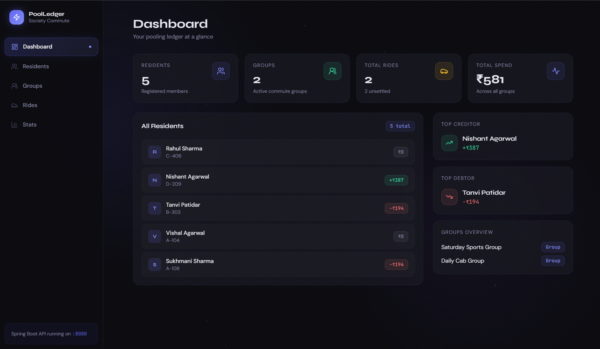
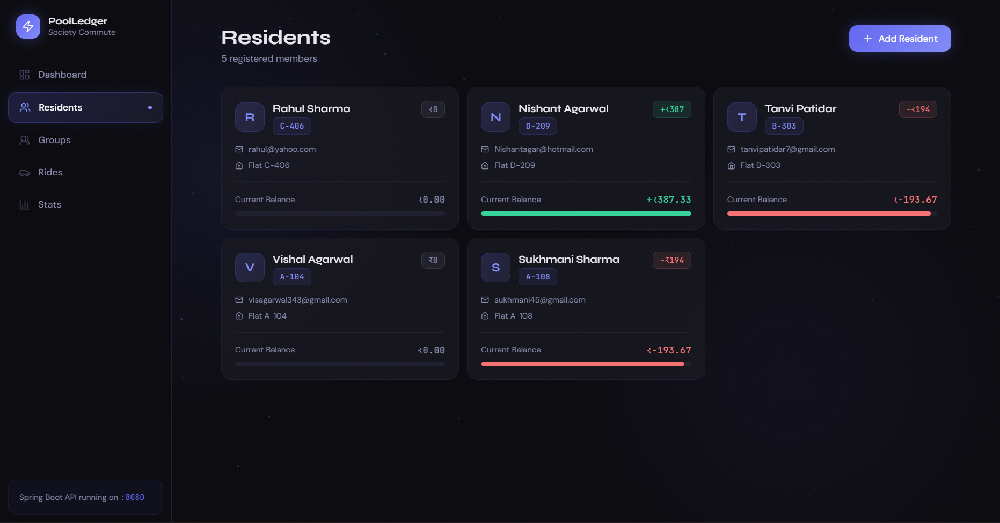
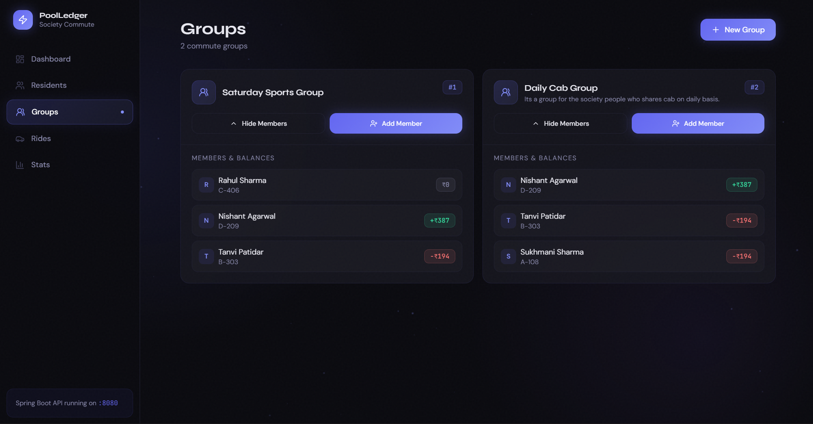
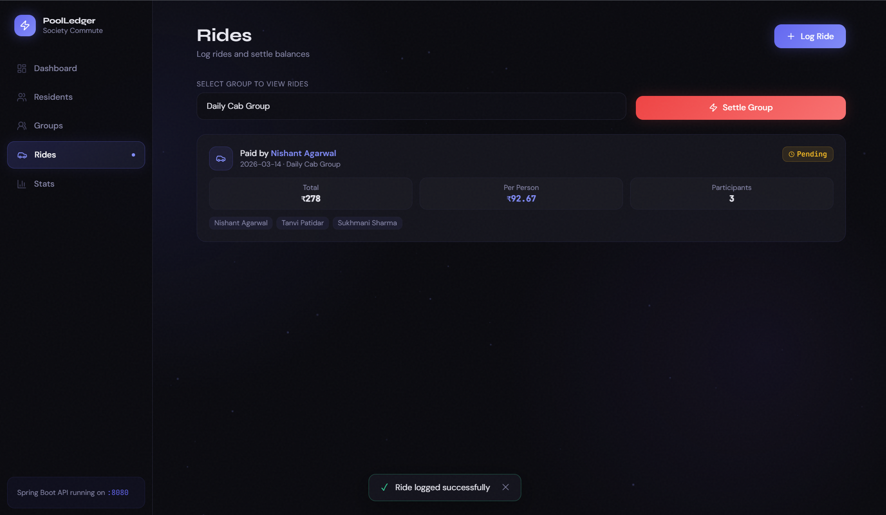
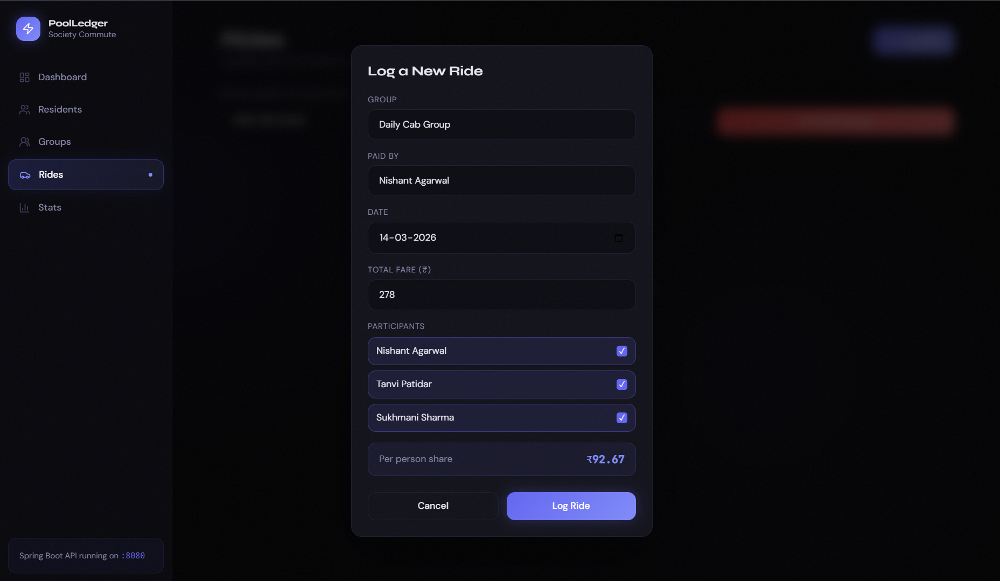
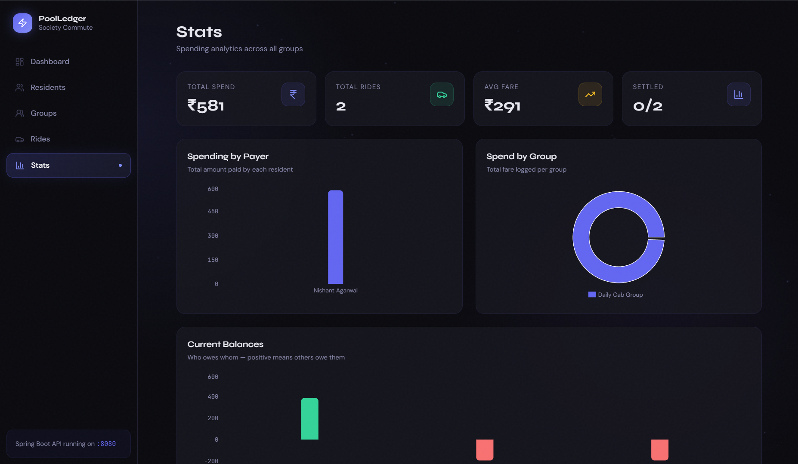

# PoolLedger — Vehicle Pooling Ledger System

A full-stack web application for apartment society residents to track shared cab fares, split costs automatically, and settle balances at the end of the month.

**Live Demo** → [vehicle-pooling-ledger-frontend.vercel.app](https://vehicle-pooling-ledger-frontend.vercel.app)


---

## Screenshots













---

## What it does

Residents of a gated society form commute groups. When someone pays for a shared cab, they log the ride, the system splits the fare equally, updates everyone's balance, and tracks who owes whom. At month end, the group settles up offline and resets all balances with one click.

---

## Features

- Register residents with flat numbers and track running balances
- Create ride groups and manage members
- Log rides, auto-splits fare and updates all participant balances
- Dashboard showing top creditor, top debtor, and group overview
- Stats page with spending charts per person and per group
- One-click group settle that resets all balances to zero
- `@Transactional` ensures balance updates never leave the database in a partial state

---

## Tech Stack

| Layer | Technology |
|---|---|
| Frontend | React 19, Vite, Tailwind CSS, Framer Motion, Recharts |
| Backend | Spring Boot 3.5, Java 17, Spring Data JPA, Hibernate |
| Database | MySQL 8.0 |
| Deployment | Vercel (frontend), Railway (backend + DB) |

---

## API Endpoints

| Method | Endpoint | Description |
|---|---|---|
| POST | `/api/residents` | Register a resident |
| GET | `/api/residents` | Get all residents |
| GET | `/api/residents/{id}/balance` | Get resident balance |
| POST | `/api/groups` | Create a group |
| POST | `/api/groups/{id}/members` | Add member to group |
| GET | `/api/groups/{id}/members` | Get members with balances |
| POST | `/api/rides` | Log a ride |
| GET | `/api/rides?groupId={id}` | Get rides for a group |
| PATCH | `/api/rides/settle?groupId={id}` | Settle group balances |

---

## Balance Logic

```
Fare: ₹240  |  Participants: 3  |  Paid by: Rahul

perPersonShare = 240 / 3 = ₹80

Every participant  →  balance -= 80
Payer (Rahul)      →  balance += 240

Result:
  Rahul   →  -80 + 240  =  +₹160  (others owe him)
  Priya   →  -80        =  -₹80   (she owes)
  Sneha   →  -80        =  -₹80   (she owes)
```

---

## Run Locally

**Backend**
```bash
git clone https://github.com/Suryaguptaa/vehicle-pooling-ledger.git
cd vehicle-pooling-ledger

# Create MySQL database
mysql -u root -p
CREATE DATABASE vehicle_pooling_db;

# Run
mvn spring-boot:run
```

**Frontend**
```bash
git clone https://github.com/Suryaguptaa/vehicle-pooling-ledger-frontend.git
cd vehicle-pooling-ledger-frontend

npm install --legacy-peer-deps
npm run dev
```

---

## Project Structure

```
src/main/java/com/pooling/ledger/
├── entity/         Resident, RideGroup, Ride
├── repository/     Spring Data JPA repositories
├── service/        Business logic + @Transactional
├── controller/     REST endpoints
├── dto/            Request/Response objects
└── exception/      GlobalExceptionHandler
```

---

## Team

Built as a 6th Semester project at **Lakshmi Narain College of Technology Excellence**

| Name | Role |
|---|---|
| Surya Dev Gupta | Backend — Spring Boot, JPA, REST API |
| Eshant Likhitkar | Frontend — React, UI/UX, Tailwind |
| Rishabh Singh | Database Design, Deployment, Testing |

---

## License

MIT License — see [LICENSE](LICENSE) for details.